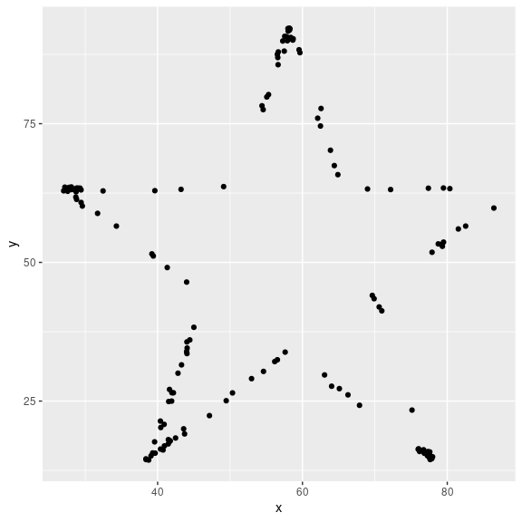
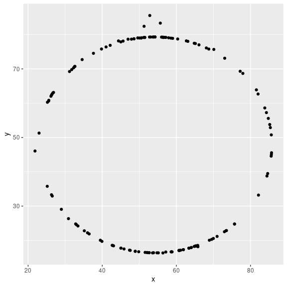
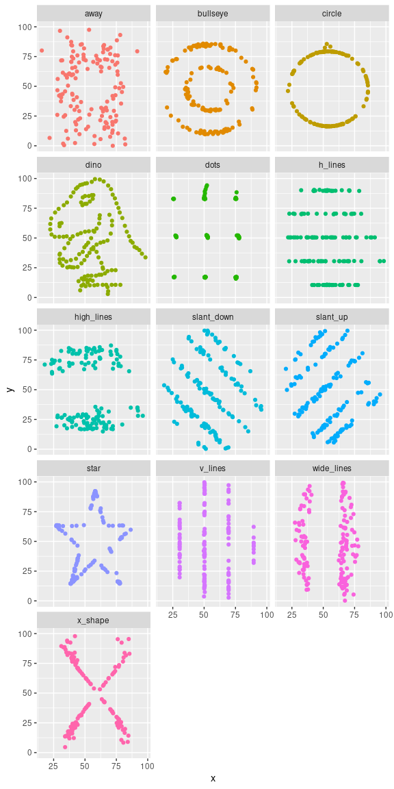

Lab 01 - Hello R
================
Alison Yao
Sept 24, 2021

## Load packages and data

``` r
library(tidyverse) 
library(datasauRus)
```

## Exercises

### Exercise 1

The `datasaurus_dozen` file has 1846 rows and 3 columns. There are 3
variable: `dataset`, `x`, and `y`. `dataset` indicates which dataset the
data is from; `x` means the x values; `y` means the y values.

Following the instructions, we can check the frequency table:

``` r
datasaurus_dozen %>%
  count(dataset) %>%
  print(13)
```

    ## # A tibble:
    ## #   13 × 2
    ##    dataset   
    ##    <chr>     
    ##  1 away      
    ##  2 bullseye  
    ##  3 circle    
    ##  4 dino      
    ##  5 dots      
    ##  6 h_lines   
    ##  7 high_lines
    ##  8 slant_down
    ##  9 slant_up  
    ## 10 star      
    ## 11 v_lines   
    ## 12 wide_lines
    ## 13 x_shape   
    ## # … with 1
    ## #   more
    ## #   variable:
    ## #   n <int>

``` r
# strange that print(13) is only going to show the column on the left
```

We can also check what the first 5 rows look like:

``` r
# check head
datasaurus_dozen[1:5,]
```

    ## # A tibble: 5 × 3
    ##   dataset     x     y
    ##   <chr>   <dbl> <dbl>
    ## 1 dino     55.4  97.2
    ## 2 dino     51.5  96.0
    ## 3 dino     46.2  94.5
    ## 4 dino     42.8  91.4
    ## 5 dino     40.8  88.3

### Exercise 2

First let’s plot the data in the dino dataset:

``` r
dino_data <- datasaurus_dozen %>%
  filter(dataset == "dino")

ggplot(data = dino_data, mapping = aes(x = x, y = y)) +
  geom_point()
```

<!-- -->

And next calculate the correlation between `x` and `y` in this dataset:

``` r
dino_data %>%
  summarize(r = cor(x, y))
```

    ## # A tibble: 1 × 1
    ##         r
    ##     <dbl>
    ## 1 -0.0645

### Exercise 3

<!-- Add code and narrative as needed. -->
<!-- Note that the R chunks are labelled with `plot-star` and `cor-star` to provide spaces to place the code for plotting and calculating the correlation coefficient. -->
<!-- To finish, clean up the narrative by removing these instructions. -->

Similarly, we first filter the observations belonging to the star
dataset and store the filtering results into a new dataframe called
`star_data`. Then, we use `ggplot` to visualize the data in points.

``` r
star_data <- datasaurus_dozen %>%
  filter(dataset == "star")

ggplot(data = star_data, mapping = aes(x = x, y = y)) + 
  geom_point()
```

<!-- -->

Again, we use the pipe operator `%>%` to send the dataframe `star_data`
as the first argument to the `summarize` function and calculate the
correlation coefficient.

``` r
star_data %>%
  summarize(r = cor(x, y))
```

    ## # A tibble: 1 × 1
    ##         r
    ##     <dbl>
    ## 1 -0.0630

Compared to the `r` of `dino`, the `r` of `star` is slightly bigger, but
almost the same.

### Exercise 4

<!-- Add code and narrative as needed. -->
<!-- Note that two R chunks are given but they are not labeled. -->
<!-- Use the convention from above to name them appropriately. -->

We filter the observations belonging to the `circle` dataset and store
the filtering results into a new dataframe called `circle_data`. Then,
we use `ggplot` to visualize the data in points.

``` r
circle_data <- datasaurus_dozen %>%
  filter(dataset == "circle")

ggplot(data = circle_data, mapping = aes(x = x, y = y)) +
  geom_point()
```

<!-- -->

We can use the pipe operator `%>%` to send the dataframe `circle_data`
as the first argument to the `summarize` function and calculate its
correlation coefficient accordingly.

``` r
circle_data %>%
  summarize(r = cor(x, y))
```

    ## # A tibble: 1 × 1
    ##         r
    ##     <dbl>
    ## 1 -0.0683

Compared to the `r` of `dino`, the `r` of `circle` is a little bit
smaller by about 0.004.

### Exercise 5

<!-- Add code and narrative as needed. -->
<!-- To add R chunks either type out the backticks, curly braces, and the letter `r` or use the Insert chunk button above, green C+. -->

First, let’s use faceting to plot all datasets at once.

``` r
ggplot(datasaurus_dozen, aes(x = x, y = y, color = dataset))+
  geom_point()+
  facet_wrap(~ dataset, ncol = 3) +
  theme(legend.position = "none")
```

<!-- -->

Then, we use the `group_by` function to generate all the summary
correlation coefficients.

``` r
datasaurus_dozen %>%
  group_by(dataset) %>%
  summarize(r = cor(x, y)) #%>% print(13)
```

    ## # A tibble: 13 × 2
    ##    dataset          r
    ##    <chr>        <dbl>
    ##  1 away       -0.0641
    ##  2 bullseye   -0.0686
    ##  3 circle     -0.0683
    ##  4 dino       -0.0645
    ##  5 dots       -0.0603
    ##  6 h_lines    -0.0617
    ##  7 high_lines -0.0685
    ##  8 slant_down -0.0690
    ##  9 slant_up   -0.0686
    ## 10 star       -0.0630
    ## 11 v_lines    -0.0694
    ## 12 wide_lines -0.0666
    ## 13 x_shape    -0.0656
