Lab 02 - Plastic waste
================
Alison Yao
Sept 29, 2021

<!-- https://rstudio-education.github.io/datascience-box/course-materials/lab-instructions/lab-02/lab-02-plastic-waste.html -->

## Warm up

### 1

The `Source` window is where I open up my Rmarkdown file and code in.
The `Console` window is where I test run code or view data and receive
error messages, so that I can make sure what I write in the Rmarkdown
file is correct. The `Environment/History/Git` window is where I check
basic information about the data, see the history of what I’ve run and
interact with GitHub. The `File/Plots/Packages/Help/Viewer` window is
where I can see and open up files in the directory, install packages,
check R commands and resources, and view the file after knitting.

### 2

There are 240 observations and 10 variables.

### 3

NA means empty value or no value.

## Load packages and data

``` r
library(tidyverse) 
```

``` r
plastic_waste <- read_csv("data/plastic-waste.csv")
glimpse(plastic_waste)
```

    ## Rows: 240
    ## Columns: 10
    ## $ code                             <chr> "AFG", "ALB", "DZA", "ASM", "AND", "A…
    ## $ entity                           <chr> "Afghanistan", "Albania", "Algeria", …
    ## $ continent                        <chr> "Asia", "Europe", "Africa", "Oceania"…
    ## $ year                             <dbl> 2010, 2010, 2010, 2010, 2010, 2010, 2…
    ## $ gdp_per_cap                      <dbl> 1614.255, 9927.182, 12870.603, NA, NA…
    ## $ plastic_waste_per_cap            <dbl> NA, 0.069, 0.144, NA, NA, 0.062, 0.25…
    ## $ mismanaged_plastic_waste_per_cap <dbl> NA, 0.032, 0.086, NA, NA, 0.045, 0.01…
    ## $ mismanaged_plastic_waste         <dbl> NA, 29705, 520555, NA, NA, 62528, 52,…
    ## $ coastal_pop                      <dbl> NA, 2530533, 16556580, NA, NA, 379004…
    ## $ total_pop                        <dbl> 31411743, 3204284, 35468208, 68420, 8…

## Exercises

Before doing the exercises, let’s first follow the instructions and work
on something else instead.

``` r
ggplot(plastic_waste, 
       aes(x = plastic_waste_per_cap)) +
  geom_histogram(binwidth = 0.2)
```

    ## Warning: Removed 51 rows containing non-finite values (stat_bin).

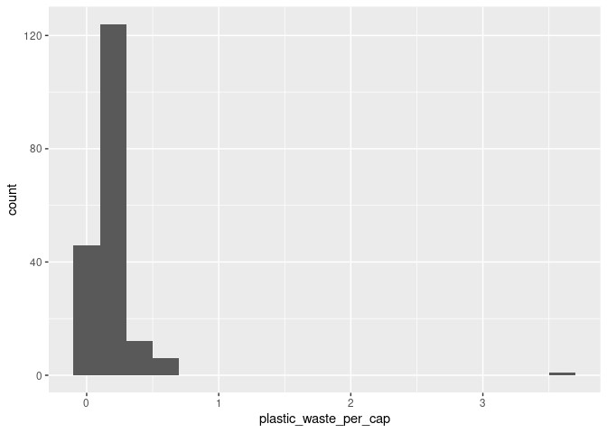<!-- -->

Let’s check the one country that is all the way to the right in the
histogram.

``` r
plastic_waste %>%
  filter(plastic_waste_per_cap > 3.5)
```

    ## # A tibble: 1 × 10
    ##   code  entity              continent  year gdp_per_cap plastic_waste_p… mismanaged_plas…
    ##   <chr> <chr>               <chr>     <dbl>       <dbl>            <dbl>            <dbl>
    ## 1 TTO   Trinidad and Tobago North Am…  2010      31261.              3.6             0.19
    ## # … with 3 more variables: mismanaged_plastic_waste <dbl>, coastal_pop <dbl>,
    ## #   total_pop <dbl>

### Exercise 1

First, we use histograms to plot the distribution of plastic waste per
capita faceted by continent.

``` r
ggplot(plastic_waste, 
       aes(x = plastic_waste_per_cap, 
           fill = continent)) +
  geom_histogram(binwidth = 0.1) +
  facet_wrap(. ~ continent, nrow = 3) + 
  labs(
    title = "Histograms of Plastic Waste per capita Faceted by Continent",
    x = "Plastic Waste per capita", 
    y = "Frequency"
  )
```

    ## Warning: Removed 51 rows containing non-finite values (stat_bin).

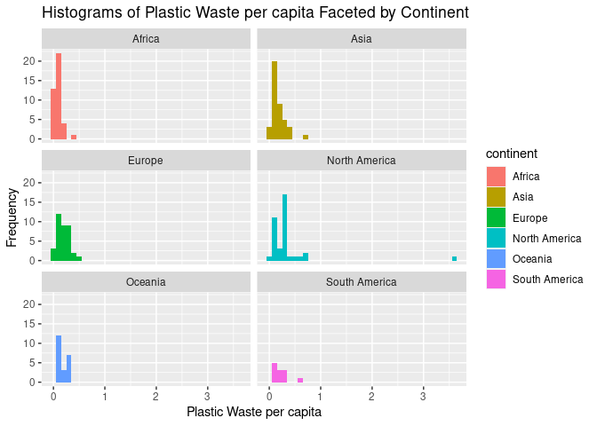<!-- -->

By looking at the plot, it seems that all continents apart from North
America have plastic waste per capita within 0 and 1. Oceania and South
America have lower plastic waste per capita overall than the other 4
continents.

Following the instructions, another way of visualizing numerical data is
using density plots.

``` r
ggplot(plastic_waste, 
       aes(x = plastic_waste_per_cap,
           color = continent,
           fill = continent)) + 
  geom_density(alpha = 0.7)
```

    ## Warning: Removed 51 rows containing non-finite values (stat_density).

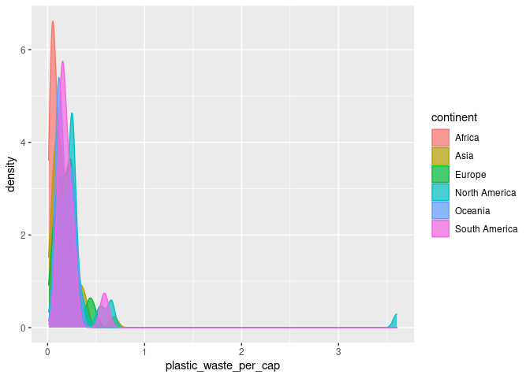<!-- -->

I personally think putting all density plots in one is messy, so I
prefer to keep them separated.

``` r
ggplot(plastic_waste, 
       aes(x = plastic_waste_per_cap,
           color = continent,
           fill = continent)) + 
  geom_density(alpha = 0.7) + 
  facet_wrap(~ continent, nrow = 3) + 
  labs(
    title = "Density Plots of Plastic Waste per capita Faceted by Continent",
    x = "Plastic Waste per capita", 
    y = "Density"
  )
```

    ## Warning: Removed 51 rows containing non-finite values (stat_density).

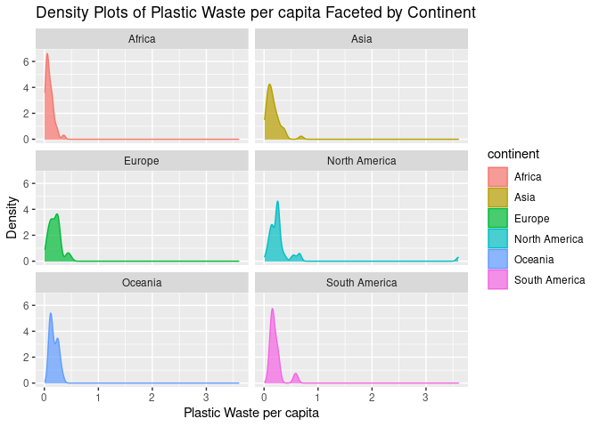<!-- -->
Now, I think this one looks better.

### Exercise 2

Here, I use a lower `alpha` calue, so that the density plots are more
transparent and a bit easier to compare. (Still think the plot above is
better, but that is not what the exercise is asking for…)

``` r
ggplot(plastic_waste, 
       aes(x = plastic_waste_per_cap,
           color = continent,
           fill = continent)) + 
  geom_density(alpha = 0.1) + 
  labs(
    title = "Density Plots of Plastic Waste per capita",
    x = "Plastic Waste per capita", 
    y = "Density"
  )
```

    ## Warning: Removed 51 rows containing non-finite values (stat_density).

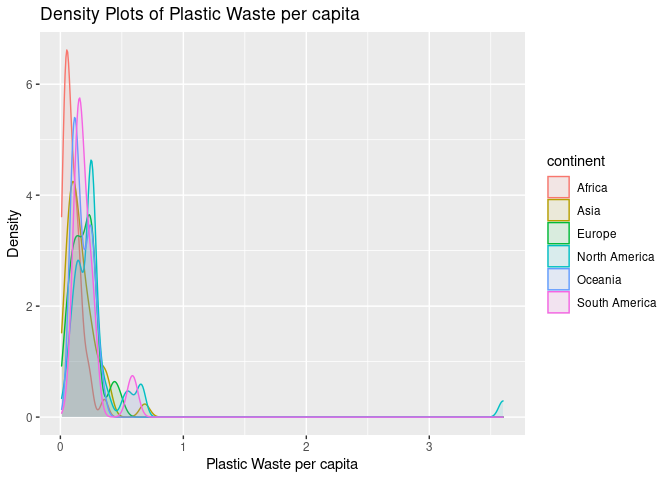<!-- -->

### Exercise 3

Because `color` and `fill` are mapped to `continent` variable, while
`alpha` is set to a fixed number. The former is mapping, so we use
`aes()` function, while the latter is setting, so we use a plotting
geom.

### Exercise 4

First, we visualize using boxplot according to the instructions.

``` r
ggplot(plastic_waste,
       aes(x = continent,
           y = plastic_waste_per_cap)) +
  geom_boxplot()
```

    ## Warning: Removed 51 rows containing non-finite values (stat_boxplot).

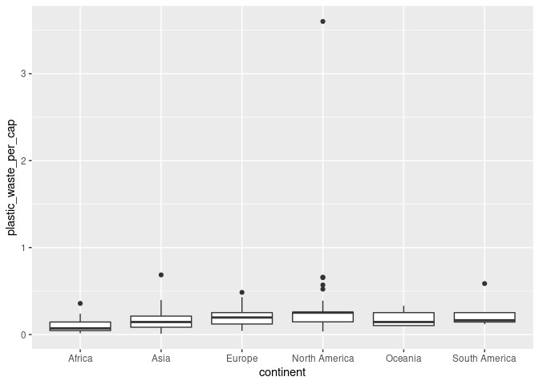<!-- -->

Then, we convert the plot into a violin plot to compare.

``` r
ggplot(plastic_waste, 
       aes(x = continent,
           y = plastic_waste_per_cap)) + 
  geom_violin()
```

    ## Warning: Removed 51 rows containing non-finite values (stat_ydensity).

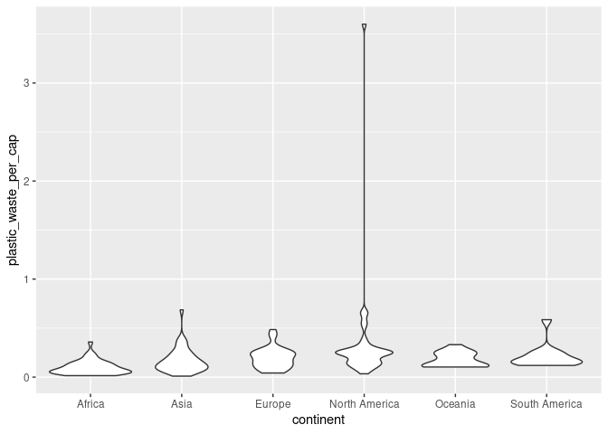<!-- -->

Violin plots give us the distributions, while box plots cannot. Box
plots are explicit about the median, 25% and 75% quartiles, upper and
lower adjacent values, and outliers, while violin plots are not.

### Exercise 5

First, we visualize the relationship between plastic waste per capita
and mismanaged plastic waste per capita using a scatterplot.

``` r
ggplot(plastic_waste, 
       aes(x = plastic_waste_per_cap, 
           y = mismanaged_plastic_waste_per_cap)) + 
  geom_point() +
  labs(
    title = "Mismanaged Plastic Waste per capita vs Platic Waste per capita", 
    x  = "Platic Waste per capita",
    y = "Mismanaged Plastic Waste per capita"
  )
```

    ## Warning: Removed 51 rows containing missing values (geom_point).

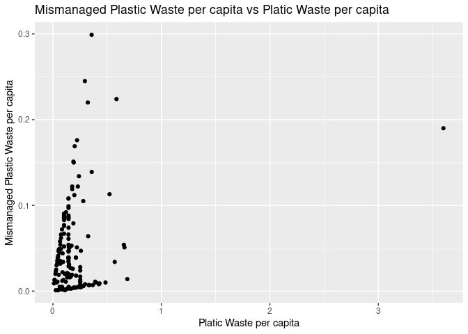<!-- -->

From the scatterplot, one can see that most points are on or between two
straight lines which intersect at the origin, indicating that the two
features are linearly associated.

### Exercise 6

Then, we color the point according to continents.

``` r
ggplot(plastic_waste, 
       aes(x = plastic_waste_per_cap, 
           y = mismanaged_plastic_waste_per_cap,
           color = continent)) + 
  geom_point() +
  labs(
    title = "Mismanaged Plastic Waste per capita vs Plastic Waste per capita", 
    x  = "Platic Waste per capita",
    y = "Mismanaged Plastic Waste per capita"
  )
```

    ## Warning: Removed 51 rows containing missing values (geom_point).

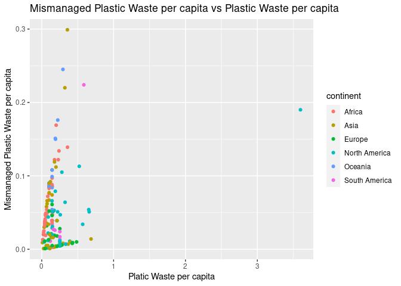<!-- -->

Africa and Oceania have a clearer distinction from the others. Most of
their points are on the line with the bigger slope, meaning that the
mismanagement problem of plastic waste per capita is more severe on
these two continents. In contrast, Asia, Europe, North America and South
America have more dispersion, meaning that there are some countries on
these continents that manage their plastic waste well, but some manage
poorly.

### Exercise 7

First, we make the scatter plots of the relationship between plastic
waste per capita and total population and the relationship between
plastic waste per capita and coastal population.

``` r
ggplot(plastic_waste,
       aes(x = plastic_waste_per_cap, 
           y = total_pop)) + 
  geom_point() + 
  labs(
    title = "Plastic Waste per capita vs Total Population",
    x = "Plastic Waste per capita",
    y = "Total Population"
  )
```

    ## Warning: Removed 61 rows containing missing values (geom_point).

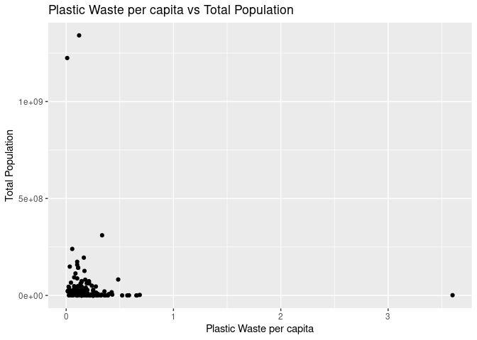<!-- -->

``` r
ggplot(plastic_waste,
       aes(x = plastic_waste_per_cap, 
           y = coastal_pop)) + 
  geom_point() + 
  labs(
    title = "Plastic Waste per capita vs Coastal Population",
    x = "Plastic Waste per capita",
    y = "Coastal Population"
  )
```

    ## Warning: Removed 51 rows containing missing values (geom_point).

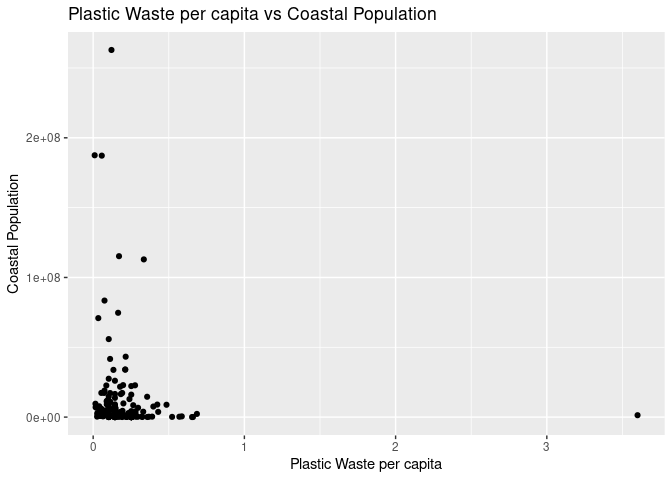<!-- -->

There does not seem to exist a strong linear association in either of
the plot. But perhaps it is because we did not zoom in enough due to
outliers?

Let’s zoom in by filtering the region where the points are too clustered
together.

``` r
plastic_waste %>%
  filter(plastic_waste_per_cap < 1 & total_pop < 1e+08) %>%
  ggplot(aes(x = plastic_waste_per_cap, 
             y = total_pop)) + 
    geom_point() + 
    labs(
      title = "Plastic Waste per capita vs Total Population Zoomed In",
      x = "Plastic Waste per capita",
      y = "Total Population"
    )
```

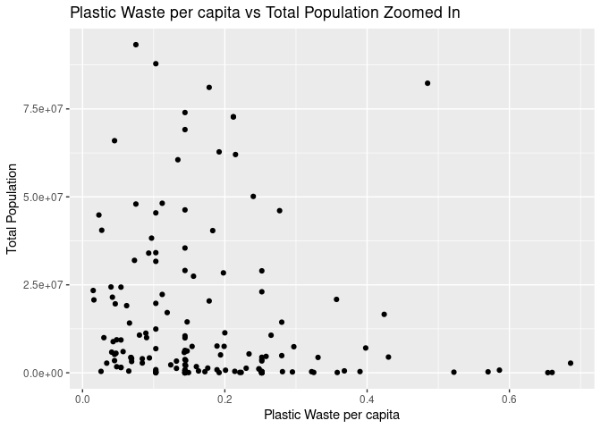<!-- -->

``` r
plastic_waste %>%
  filter(plastic_waste_per_cap < 1 & coastal_pop < 1e+08) %>%
  ggplot(aes(x = plastic_waste_per_cap, 
             y = coastal_pop)) + 
    geom_point() + 
    labs(
      title = "Plastic Waste per capita vs Coastal Population Zoomed In",
      x = "Plastic Waste per capita",
      y = "Coastal Population"
    )
```

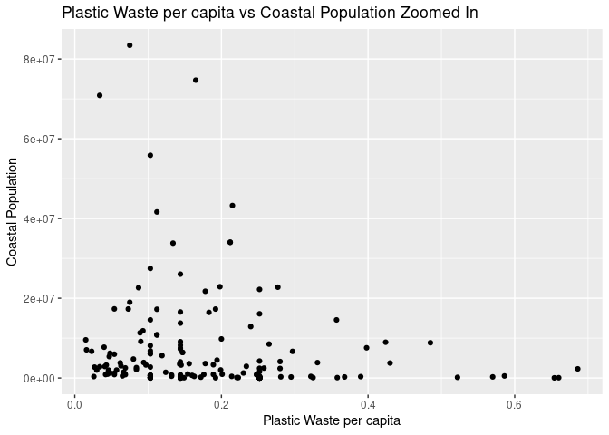<!-- -->

Still, I don’t really see any linear association.

### Exercise 8

In an attempt to recreate the plot, I used a filter to find the right
range for the plot. I calculated the ratio of coastal/total population
as the x values. I used color blind friendly color to represent
different continents. To add a regression line and its confidence
interval, I used two `geom` functions and changed the color for
`geom_smooth` to black. One thing to note is that I needed to put
`color = continent` in `geom_point` instead of `ggplot` like I always do
because I need the regression line to fit all datapoints. I added labels
and a theme accordingly and removed the border.

``` r
plastic_waste %>%
  filter(plastic_waste_per_cap < 1) %>%
  ggplot(aes(x = coastal_pop / total_pop,
             y = plastic_waste_per_cap)) + 
    geom_point(aes(color = continent)) + 
    geom_smooth(color = 'black') +
    labs(
      title = 'Plastic waste vs coastal population proportion',
      subtitle = "by continent",
      x = "Coastal population proportion (Coastal / total population)",
      y = "Plastic waste per capita",
      color = "Continent"
    ) + 
  scale_colour_viridis_d() +
  theme_bw() + 
  theme(
    panel.border = element_blank()
  )
```

    ## `geom_smooth()` using method = 'loess' and formula 'y ~ x'

    ## Warning: Removed 10 rows containing non-finite values (stat_smooth).

    ## Warning: Removed 10 rows containing missing values (geom_point).

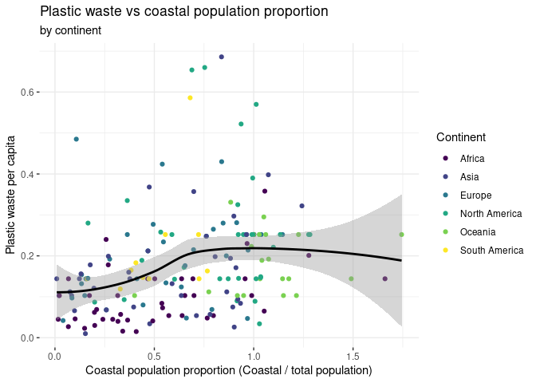<!-- -->
