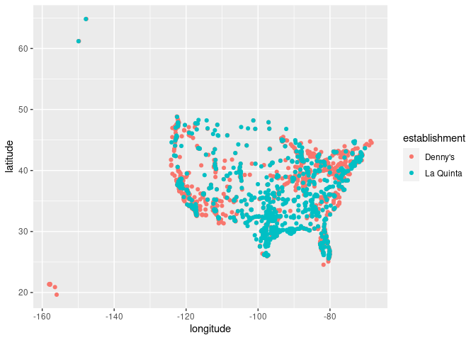
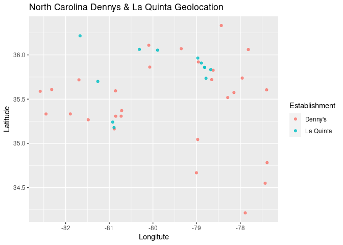
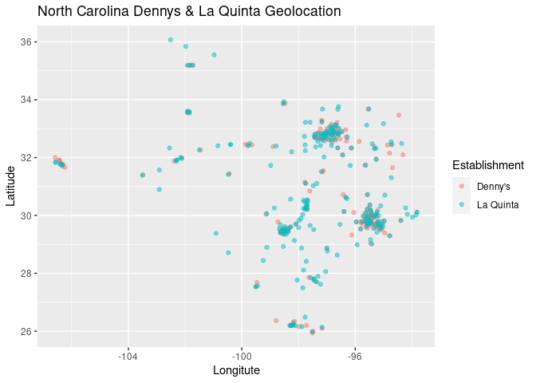

Lab 04 - La Quinta is Spanish for next to Denny’s, Pt. 1
================
Alison Yao
Oct 8, 2021

<!-- instructions: https://rstudio-education.github.io/datascience-box/course-materials/lab-instructions/lab-04/lab-04-viz-sp-data.html -->

### Load packages and data

``` r
library(tidyverse) 
library(dsbox) 
```

``` r
states <- read_csv("data/states.csv")
```

### Exercise 1

The dimension of `dennys` is 1643, 6, which means there are 1643
observations and 6 variables. Each row represents the features of one
Denny’s diner. The variables include address, city, state, zip,
longitude and latitude.

### Exercise 2

The dimension of `laquinta` is 909, 6, which means there are 909
observations and 6 variables. Each row represents the features of one La
Quinta hotel. The variables include address, city, state, zip, longitude
and latitude.

### Exercise 3

According to La Quinta’s website, they also have hotels in Canada,
Mexico, New Zealand, Honduras, Turkey, UAE, Chile and Colombia.
According to Denny’e website, all of their diners are in the US.

### Exercise 4

The abbreviation variable in states matches the state variable in dennys
and laquinta, so we can use anti\_join to check if there are any
locations outside of US states.

There are 14 La Quinta hotels outside of the US. They are in Mexico,
Colombia, Canada, and Honduras. This does not match the website,
probably because the data collected is outdated.

``` r
anti_join(laquinta, states, by=c('state' = 'abbreviation')) %>% 
  select(address, city)
```

    ## # A tibble: 14 × 2
    ##    address                                       city                           
    ##    <chr>                                         <chr>                          
    ##  1 Carretera Panamericana Sur KM 12              "\nAguascalientes"             
    ##  2 Av. Tulum Mza. 14 S.M. 4 Lote 2               "\nCancun"                     
    ##  3 Ejercito Nacional 8211                        "Col\nPartido Iglesias\nJuarez"
    ##  4 Blvd. Aeropuerto 4001                         "Parque Industrial Interameric…
    ##  5 Carrera 38 # 26-13 Avenida las Palmas con Lo… "\nMedellin Colombia"          
    ##  6 AV. PINO SUAREZ No. 1001                      "Col. Centro\nMonterrey"       
    ##  7 Av. Fidel Velazquez #3000 Col. Central        "\nMonterrey"                  
    ##  8 63 King Street East                           "\nOshawa"                     
    ##  9 Calle Las Torres-1 Colonia Reforma            "\nPoza Rica"                  
    ## 10 Blvd. Audi N. 3 Ciudad Modelo                 "\nSan Jose Chiapa"            
    ## 11 Ave. Zeta del Cochero No 407                  "Col. ReservaTerritorial Atlix…
    ## 12 Av. Benito Juarez 1230 B (Carretera 57) Col.… "\nSan Luis Potosi"            
    ## 13 Blvd. Fuerza Armadas                          "contiguo Mall Las Cascadas\nT…
    ## 14 8640 Alexandra Rd                             "\nRichmond"

There are 0 Denny’s diner outside of the US.

``` r
anti_join(dennys, states, by=c('state' = 'abbreviation')) %>% 
  select(address, city)
```

    ## # A tibble: 0 × 2
    ## # … with 2 variables: address <chr>, city <chr>

### Exercise 5

Mine thinks the same as me. Yay! But she is using filter instead of
anti\_join.

``` r
dennys %>%
  filter(!(state %in% states$abbreviation))
```

    ## # A tibble: 0 × 6
    ## # … with 6 variables: address <chr>, city <chr>, state <chr>, zip <chr>,
    ## #   longitude <dbl>, latitude <dbl>

The table has no observations, so there are no Denny’s outside of the
US.

### Exercise 6

We need to save the results to dennys variable so that we can store the
new dataframe with the new variable country.

``` r
dennys <-dennys %>%
  mutate(country = "United States")
```

### Exercise 7

Here, I use filter to see if I get the same results as using anti\_join.
And I do.

``` r
laquinta %>%
  filter(!(state %in% states$abbreviation))
```

    ## # A tibble: 14 × 6
    ##    address                     city               state zip   longitude latitude
    ##    <chr>                       <chr>              <chr> <chr>     <dbl>    <dbl>
    ##  1 Carretera Panamericana Sur… "\nAguascalientes" AG    20345    -102.     21.8 
    ##  2 Av. Tulum Mza. 14 S.M. 4 L… "\nCancun"         QR    77500     -86.8    21.2 
    ##  3 Ejercito Nacional 8211      "Col\nPartido Igl… CH    32528    -106.     31.7 
    ##  4 Blvd. Aeropuerto 4001       "Parque Industria… NL    66600    -100.     25.8 
    ##  5 Carrera 38 # 26-13 Avenida… "\nMedellin Colom… ANT   0500…     -75.6     6.22
    ##  6 AV. PINO SUAREZ No. 1001    "Col. Centro\nMon… NL    64000    -100.     25.7 
    ##  7 Av. Fidel Velazquez #3000 … "\nMonterrey"      NL    64190    -100.     25.7 
    ##  8 63 King Street East         "\nOshawa"         ON    L1H1…     -78.9    43.9 
    ##  9 Calle Las Torres-1 Colonia… "\nPoza Rica"      VE    93210     -97.4    20.6 
    ## 10 Blvd. Audi N. 3 Ciudad Mod… "\nSan Jose Chiap… PU    75010     -97.8    19.2 
    ## 11 Ave. Zeta del Cochero No 4… "Col. ReservaTerr… PU    72810     -98.2    19.0 
    ## 12 Av. Benito Juarez 1230 B (… "\nSan Luis Potos… SL    78399    -101.     22.1 
    ## 13 Blvd. Fuerza Armadas        "contiguo Mall La… FM    11101     -87.2    14.1 
    ## 14 8640 Alexandra Rd           "\nRichmond"       BC    V6X1…    -123.     49.2

There are 14 La Quinta hotels outside of the US. They are in Mexico,
Colombia, Canada, and Honduras.

-   10 in Mexico: Aguascalientes (AG), Cancun (QR), Col Partido Iglesias
    Juarez (CH), Parque Industrial Interamerican Apodaca (NL), Col.
    Centro Monterrey (NL), Monterrey (NL), Poza Rica (VE), San Jose
    Chiapa (PU), Col. ReservaTerritorial Atlixcayotl San Puebla (PU),
    San Luis Potosi (SL)

-   1 in Colombia: Medellin Colombia (ANT)

-   2 in Canada: Oshawa (ON), Richmond (BC)

-   1 in Honduras: contiguo Mall Las Cascadas Tegucigalpa (FM)

### Exercise 8

We need to find all the state abbreviations for each city and then add a
new column to the original dataframes.

``` r
laquinta <- laquinta %>%
  mutate(country = case_when(
    state %in% state.abb                                     ~ "United States",
    state %in% c("ON", "BC")                                 ~ "Canada",
    state == "ANT"                                           ~ "Colombia",
    state == "FM"                                            ~ "Honduras",
    state %in% c('AG', 'QR', 'CH', 'NL', 'VE', 'PU', 'SL')   ~ "Mexico",
  ))
```

Before moving forward, we first filter out the data in US for La Quinta.

``` r
laquinta <- laquinta %>%
  filter(country == "United States")
```

### Exercise 9

California has the most Denny’s locations while Delaware has the fewest.
The huge number in California is not surprising because Denny’s started
in California and its founder Harold Butler is also from California.
Delaware is not very surprising either because it is not one of those
big cities where economy is booming.

``` r
dennys %>% 
  group_by(state) %>% 
  count() %>% 
  arrange(desc(n))
```

    ## # A tibble: 51 × 2
    ## # Groups:   state [51]
    ##    state     n
    ##    <chr> <int>
    ##  1 CA      403
    ##  2 TX      200
    ##  3 FL      140
    ##  4 AZ       83
    ##  5 IL       56
    ##  6 NY       56
    ##  7 WA       49
    ##  8 OH       44
    ##  9 MO       42
    ## 10 PA       40
    ## # … with 41 more rows

Texas has the most La Quinta locations while Maine has the fewest. The
huge number in Texas is 3 times as much as Florida (74), which is
tremendous. But it’s not surprising on second thought because similar to
the previous case, its founder Sam Barshop was born in Texas and has
deep roots in Texas. Maine is not very surprising because the
residential density is low and it is too cold for traveling, so it
probably would not be very profitable for hotels.

``` r
laquinta %>% 
  group_by(state) %>% 
  count() %>% 
  arrange(desc(n))
```

    ## # A tibble: 48 × 2
    ## # Groups:   state [48]
    ##    state     n
    ##    <chr> <int>
    ##  1 TX      237
    ##  2 FL       74
    ##  3 CA       56
    ##  4 GA       41
    ##  5 TN       30
    ##  6 OK       29
    ##  7 LA       28
    ##  8 CO       27
    ##  9 NM       19
    ## 10 NY       19
    ## # … with 38 more rows

Before moving on, let’s test this code:

``` r
dennys %>%
  count(state) %>%
  inner_join(states, by = c("state" = "abbreviation"))
```

    ## # A tibble: 51 × 4
    ##    state     n name                     area
    ##    <chr> <int> <chr>                   <dbl>
    ##  1 AK        3 Alaska               665384. 
    ##  2 AL        7 Alabama               52420. 
    ##  3 AR        9 Arkansas              53179. 
    ##  4 AZ       83 Arizona              113990. 
    ##  5 CA      403 California           163695. 
    ##  6 CO       29 Colorado             104094. 
    ##  7 CT       12 Connecticut            5543. 
    ##  8 DC        2 District of Columbia     68.3
    ##  9 DE        1 Delaware               2489. 
    ## 10 FL      140 Florida               65758. 
    ## # … with 41 more rows

Everything seems good.

### Exercise 10

The District of Columbia has the most Denny’s locations per thousand
square miles.

``` r
dennys %>%
  count(state) %>%
  inner_join(states, by = c("state" = "abbreviation")) %>% 
  summarise(state = state, 
            name = name,
            location_per_thousand_sm = n / area * 1000) %>% 
  arrange(desc(location_per_thousand_sm))
```

    ## # A tibble: 51 × 3
    ##    state name                 location_per_thousand_sm
    ##    <chr> <chr>                                   <dbl>
    ##  1 DC    District of Columbia                   29.3  
    ##  2 RI    Rhode Island                            3.24 
    ##  3 CA    California                              2.46 
    ##  4 CT    Connecticut                             2.16 
    ##  5 FL    Florida                                 2.13 
    ##  6 MD    Maryland                                2.10 
    ##  7 NJ    New Jersey                              1.15 
    ##  8 NY    New York                                1.03 
    ##  9 IN    Indiana                                 1.02 
    ## 10 OH    Ohio                                    0.982
    ## # … with 41 more rows

Rhode Island has the most La Quinta locations per thousand square miles.

``` r
laquinta %>%
  count(state) %>%
  inner_join(states, by = c("state" = "abbreviation")) %>% 
  summarise(state = state, 
            name = name,
            location_per_thousand_sm = n / area * 1000) %>% 
  arrange(desc(location_per_thousand_sm))
```

    ## # A tibble: 48 × 3
    ##    state name          location_per_thousand_sm
    ##    <chr> <chr>                            <dbl>
    ##  1 RI    Rhode Island                     1.29 
    ##  2 FL    Florida                          1.13 
    ##  3 CT    Connecticut                      1.08 
    ##  4 MD    Maryland                         1.05 
    ##  5 TX    Texas                            0.882
    ##  6 TN    Tennessee                        0.712
    ##  7 GA    Georgia                          0.690
    ##  8 NJ    New Jersey                       0.573
    ##  9 MA    Massachusetts                    0.568
    ## 10 LA    Louisiana                        0.535
    ## # … with 38 more rows

Now, we prep for the visualizations. First, add an identifier variable.

``` r
dennys <- dennys %>%
  mutate(establishment = "Denny's")
laquinta <- laquinta %>%
  mutate(establishment = "La Quinta")
```

Since the two data frames have the same columns, we can easily bind them
with the bind\_rows function:

``` r
dn_lq <- bind_rows(dennys, laquinta)
```

We can plot the locations of the two establishments using a scatter
plot, and color the points by the establishment type.

``` r
ggplot(dn_lq, mapping = aes(x = longitude, y = latitude, color = establishment)) +
  geom_point()
```

<!-- -->

### Exercise 11

``` r
dn_lq %>% 
  filter(state == 'NC') %>% 
  ggplot(aes(x = longitude, 
             y = latitude, 
             color = establishment)) + 
  geom_point(alpha = 0.8) +
  labs(
    title = 'North Carolina Dennys & La Quinta Geolocation',
    x = 'Longitute',
    y = 'Latitude',
    color = 'Establishment'
  )
```

<!-- -->

Visually, Mitch Hedberg’s joke does not seem true. Denny’s and La Quinta
do not come in pairs in North Carolina.

### Exercise 12

``` r
dn_lq %>% 
  filter(state == 'TX') %>% 
  ggplot(aes(x = longitude, 
             y = latitude, 
             color = establishment)) + 
  geom_point(alpha = 0.5) +
  labs(
    title = 'North Carolina Dennys & La Quinta Geolocation',
    x = 'Longitute',
    y = 'Latitude',
    color = 'Establishment'
  )
```

<!-- -->

This time, Mitch Hedberg’s joke seems to be true. Denny’s and La Quinta
are mostly cluster together.
