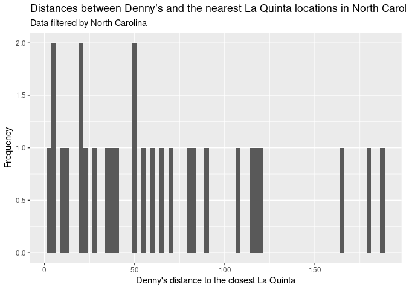
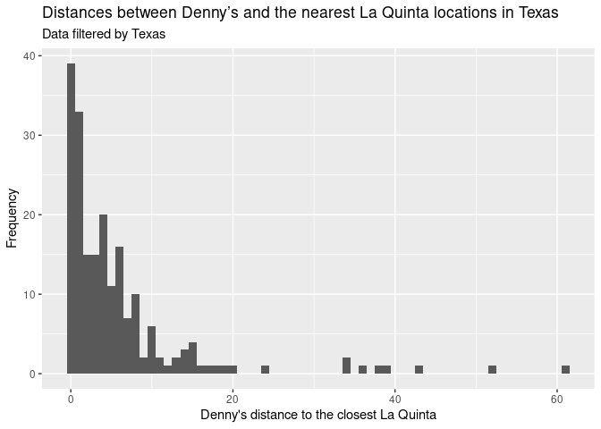

Lab 04 - La Quinta is Spanish for next to Denny’s, Pt. 2
================
Alison Yao (yy2564)
Oct 12, 2021

<!-- instructions: https://rstudio-education.github.io/datascience-box/course-materials/lab-instructions/lab-05/lab-05-wrangle-sp-data.html -->

### Load packages and data

``` r
library(tidyverse) 
library(dsbox) 
```

``` r
states <- read_csv("data/states.csv")
```

### Exercise 1

There are 3 Denny’s locations in Alaska.

``` r
dn_ak <- dennys %>%
  filter(state == "AK")
nrow(dn_ak)
```

    ## [1] 3

### Exercise 2

There are 2 La Quinta locations in Alaska.

``` r
lq_ak <- laquinta %>%
  filter(state == "AK")
nrow(lq_ak)
```

    ## [1] 2

### Exercise 3

There are 3 \* 2 = 6 pairs between all Denny’s and all La Quinta
locations in Alaska, so we need to calculate 6 distances.

### Exercise 4

``` r
dn_lq_ak <- full_join(dn_ak, lq_ak, by = "state")
dn_lq_ak
```

    ## # A tibble: 6 × 11
    ##   address.x   city.x state zip.x longitude.x latitude.x address.y  city.y  zip.y
    ##   <chr>       <chr>  <chr> <chr>       <dbl>      <dbl> <chr>      <chr>   <chr>
    ## 1 2900 Denali Ancho… AK    99503       -150.       61.2 3501 Minn… "\nAnc… 99503
    ## 2 2900 Denali Ancho… AK    99503       -150.       61.2 4920 Dale… "\nFai… 99709
    ## 3 3850 Debar… Ancho… AK    99508       -150.       61.2 3501 Minn… "\nAnc… 99503
    ## 4 3850 Debar… Ancho… AK    99508       -150.       61.2 4920 Dale… "\nFai… 99709
    ## 5 1929 Airpo… Fairb… AK    99701       -148.       64.8 3501 Minn… "\nAnc… 99503
    ## 6 1929 Airpo… Fairb… AK    99701       -148.       64.8 4920 Dale… "\nFai… 99709
    ## # … with 2 more variables: longitude.y <dbl>, latitude.y <dbl>

There are 6 observations. The variables are address.x, city.x, state,
zip.x, longitude.x, latitude.x, address.y, city.y, zip.y, longitude.y,
and latitude.y.

### Exercise 5

When adding a new variable to an existing dataframe, we use the
`mutate()` function.

``` r
haversine <- function(long1, lat1, long2, lat2, round = 3) {
  # convert to radians
  long1 = long1 * pi / 180
  lat1  = lat1  * pi / 180
  long2 = long2 * pi / 180
  lat2  = lat2  * pi / 180
  
  R = 6371 # Earth mean radius in km
  
  a = sin((lat2 - lat1)/2)^2 + cos(lat1) * cos(lat2) * sin((long2 - long1)/2)^2
  d = R * 2 * asin(sqrt(a))
  
  return( round(d,round) ) # distance in km
}
```

### Exercise 6

``` r
dn_lq_ak <- dn_lq_ak %>% 
  mutate(distance = haversine(longitude.x, latitude.x, longitude.y, latitude.y))
dn_lq_ak
```

    ## # A tibble: 6 × 12
    ##   address.x   city.x state zip.x longitude.x latitude.x address.y  city.y  zip.y
    ##   <chr>       <chr>  <chr> <chr>       <dbl>      <dbl> <chr>      <chr>   <chr>
    ## 1 2900 Denali Ancho… AK    99503       -150.       61.2 3501 Minn… "\nAnc… 99503
    ## 2 2900 Denali Ancho… AK    99503       -150.       61.2 4920 Dale… "\nFai… 99709
    ## 3 3850 Debar… Ancho… AK    99508       -150.       61.2 3501 Minn… "\nAnc… 99503
    ## 4 3850 Debar… Ancho… AK    99508       -150.       61.2 4920 Dale… "\nFai… 99709
    ## 5 1929 Airpo… Fairb… AK    99701       -148.       64.8 3501 Minn… "\nAnc… 99503
    ## 6 1929 Airpo… Fairb… AK    99701       -148.       64.8 4920 Dale… "\nFai… 99709
    ## # … with 3 more variables: longitude.y <dbl>, latitude.y <dbl>, distance <dbl>

### Exercise 7

``` r
dn_lq_ak_mindist <- dn_lq_ak %>%
  group_by(address.x) %>%
  summarise(closest = min(distance))
dn_lq_ak_mindist
```

    ## # A tibble: 3 × 2
    ##   address.x        closest
    ##   <chr>              <dbl>
    ## 1 1929 Airport Way    5.20
    ## 2 2900 Denali         2.04
    ## 3 3850 Debarr Road    6.00

### Exercise 8

``` r
dn_lq_ak_mindist %>% 
  ggplot(aes(x = closest)) +
  geom_histogram(binwidth = 0.5) + 
  labs(
    title = "Distances between Denny’s and the nearest La Quinta locations in Alaska",
    subtitle = 'Data filtered by Alaska only',
    x = "Denny's distance to the closest La Quinta",
    y = 'Frequency'
  )
```

<!-- -->

The 3 closest distances ranges from 2.035 to 5.998, with a mean of 4.41,
a medium of 5.197 and a standard deviation of 2.09544.

``` r
dn_lq_ak_mindist %>%
  summarise(
          count = n(),
          min_dist = min(closest),
          mean_dist = mean(closest),
          median_dist = median(closest),
          max_dist = max(closest),
          range_dist = max(closest) - min(closest),
          SD_dist = sd(closest)
            )
```

    ## # A tibble: 1 × 7
    ##   count min_dist mean_dist median_dist max_dist range_dist SD_dist
    ##   <int>    <dbl>     <dbl>       <dbl>    <dbl>      <dbl>   <dbl>
    ## 1     3     2.04      4.41        5.20     6.00       3.96    2.10

### Exercise 9

``` r
dn_nc <- dennys %>% filter(state == "NC") # 28
dn_nc
```

    ## # A tibble: 28 × 6
    ##    address                         city           state zip   longitude latitude
    ##    <chr>                           <chr>          <chr> <chr>     <dbl>    <dbl>
    ##  1 1 Regent Park Boulevard         Asheville      NC    28806     -82.6     35.6
    ##  2 7135 Nc #4                      Battleboro     NC    27809     -77.8     36.1
    ##  3 581 South Highway 9             Black Mountain NC    28711     -82.3     35.6
    ##  4 4541 Sunset Rd                  Charlotte      NC    28216     -80.9     35.3
    ##  5 516 Tyvola Rd                   Charlotte      NC    28217     -80.9     35.2
    ##  6 University of North Carolina At Charlotte      NC    28223     -80.7     35.3
    ##  7 8031 Concord Mills Blvd         Concord        NC    28027     -80.7     35.4
    ##  8 7021 Highway 751, #901          Durham         NC    27707     -79.0     35.9
    ##  9 5505 Raeford Rd                 Fayetteville   NC    28304     -79.0     35.0
    ## 10 808 S Memorial Dr               Greenville     NC    27834     -77.4     35.6
    ## # … with 18 more rows

``` r
lq_nc <- laquinta %>% filter(state == "NC") # 12
lq_nc
```

    ## # A tibble: 12 × 6
    ##    address                      city              state zip   longitude latitude
    ##    <chr>                        <chr>             <chr> <chr>     <dbl>    <dbl>
    ##  1 165 Hwy 105 Extension        "\nBoone"         NC    28607     -81.7     36.2
    ##  2 3127 Sloan Dr                "\nCharlotte"     NC    28208     -80.9     35.2
    ##  3 4900 South Tryon St          "\nCharlotte"     NC    28217     -80.9     35.2
    ##  4 4414 Durham Chapel Hill Blvd "\nDurham"        NC    27707     -79.0     36.0
    ##  5 1910 Westpark Dr             "\nDurham"        NC    27713     -78.9     35.9
    ##  6 1201 Lanada Rd               "\nGreensboro"    NC    27407     -79.9     36.1
    ##  7 1607 Fairgrove Church Rd     "\nConover"       NC    28613     -81.3     35.7
    ##  8 191 Crescent Commons         "\nCary"          NC    27518     -78.8     35.7
    ##  9 2211 Summit Park Ln          "\nRaleigh"       NC    27612     -78.7     35.8
    ## 10 1001 Aerial Center Pkwy      "\nMorrisville"   NC    27560     -78.8     35.9
    ## 11 1001 Hospitality Ct          "\nMorrisville"   NC    27560     -78.8     35.9
    ## 12 2020 Griffith Rd             "\nWinston-Salem" NC    27103     -80.3     36.1

``` r
dn_lq_nc <- full_join(dn_nc, lq_nc, by = "state") # 336
dn_lq_nc
```

    ## # A tibble: 336 × 11
    ##    address.x  city.x  state zip.x longitude.x latitude.x address.y  city.y zip.y
    ##    <chr>      <chr>   <chr> <chr>       <dbl>      <dbl> <chr>      <chr>  <chr>
    ##  1 1 Regent … Ashevi… NC    28806       -82.6       35.6 165 Hwy 1… "\nBo… 28607
    ##  2 1 Regent … Ashevi… NC    28806       -82.6       35.6 3127 Sloa… "\nCh… 28208
    ##  3 1 Regent … Ashevi… NC    28806       -82.6       35.6 4900 Sout… "\nCh… 28217
    ##  4 1 Regent … Ashevi… NC    28806       -82.6       35.6 4414 Durh… "\nDu… 27707
    ##  5 1 Regent … Ashevi… NC    28806       -82.6       35.6 1910 West… "\nDu… 27713
    ##  6 1 Regent … Ashevi… NC    28806       -82.6       35.6 1201 Lana… "\nGr… 27407
    ##  7 1 Regent … Ashevi… NC    28806       -82.6       35.6 1607 Fair… "\nCo… 28613
    ##  8 1 Regent … Ashevi… NC    28806       -82.6       35.6 191 Cresc… "\nCa… 27518
    ##  9 1 Regent … Ashevi… NC    28806       -82.6       35.6 2211 Summ… "\nRa… 27612
    ## 10 1 Regent … Ashevi… NC    28806       -82.6       35.6 1001 Aeri… "\nMo… 27560
    ## # … with 326 more rows, and 2 more variables: longitude.y <dbl>,
    ## #   latitude.y <dbl>

``` r
dn_lq_nc <- dn_lq_nc %>% 
  mutate(distance = haversine(longitude.x, latitude.x, longitude.y, latitude.y))
dn_lq_nc_mindist <- dn_lq_nc %>%
  group_by(address.x) %>%
  summarise(closest = min(distance))
dn_lq_nc_mindist # 28
```

    ## # A tibble: 28 × 2
    ##    address.x                 closest
    ##    <chr>                       <dbl>
    ##  1 1 Regent Park Boulevard     108. 
    ##  2 101 Wintergreen Dr          120. 
    ##  3 103 Sedgehill Dr             26.7
    ##  4 1043 Jimmie Kerr Road        36.1
    ##  5 1201 S College Road         188. 
    ##  6 1209 Burkemount Avenue       39.1
    ##  7 1493 Us Hwy 74-A Bypass      70.1
    ##  8 1524 Dabney Dr               59.5
    ##  9 1550 Four Seasons           115. 
    ## 10 1800 Princeton-Kenly Road    55.9
    ## # … with 18 more rows

``` r
dn_lq_nc_mindist %>% 
  ggplot(aes(x = closest)) +
  geom_histogram(binwidth = 2.5) + 
  labs(
    title = "Distances between Denny’s and the nearest La Quinta locations in North Carolina",
    subtitle = 'Data filtered by North Carolina',
    x = "Denny's distance to the closest La Quinta",
    y = 'Frequency'
  )
```

<!-- -->

The 28 closest distances ranges from 1.779 to 187.935, with a mean of
65.44432, a medium of 53.4565 and a standard deviation of 53.42398.

``` r
dn_lq_nc_mindist %>%
  summarise(
          count = n(),
          min_dist = min(closest),
          mean_dist = mean(closest),
          median_dist = median(closest),
          max_dist = max(closest),
          range_dist = max(closest) - min(closest),
          SD_dist = sd(closest)
            )
```

    ## # A tibble: 1 × 7
    ##   count min_dist mean_dist median_dist max_dist range_dist SD_dist
    ##   <int>    <dbl>     <dbl>       <dbl>    <dbl>      <dbl>   <dbl>
    ## 1    28     1.78      65.4        53.5     188.       186.    53.4

### Exercise 10

``` r
dn_tx <- dennys %>% filter(state == "TX") # 200
dn_tx
```

    ## # A tibble: 200 × 6
    ##    address                  city      state zip   longitude latitude
    ##    <chr>                    <chr>     <chr> <chr>     <dbl>    <dbl>
    ##  1 120 East I-20            Abilene   TX    79601     -99.6     32.4
    ##  2 3314 S Clack Street      Abilene   TX    79601     -99.8     32.4
    ##  3 209 Central Expressway N Allen     TX    75013     -96.7     33.1
    ##  4 1710 I-40 East           Amarillo  TX    79103    -102.      35.2
    ##  5 2116 S Georgia St        Amarillo  TX    79109    -102.      35.2
    ##  6 9601 I-40 East Exit 76   Amarillo  TX    79111    -102.      35.2
    ##  7 3001 Mountain Pass Blvd  Anthony   TX    79821    -107.      32.0
    ##  8 839 N Watson Road        Arlington TX    76011     -97.1     32.8
    ##  9 4820 W Sublett Road      Arlington TX    76017     -97.2     32.6
    ## 10 4928 S Cooper            Arlington TX    76017     -97.1     32.7
    ## # … with 190 more rows

``` r
lq_tx <- laquinta %>% filter(state == "TX") # 237
lq_tx
```

    ## # A tibble: 237 × 6
    ##    address                       city         state zip   longitude latitude
    ##    <chr>                         <chr>        <chr> <chr>     <dbl>    <dbl>
    ##  1 3018 CatClaw Dr               "\nAbilene"  TX    79606     -99.8     32.4
    ##  2 3501 West Lake Rd             "\nAbilene"  TX    79601     -99.7     32.5
    ##  3 14925 Landmark Blvd           "\nAddison"  TX    75254     -96.8     33.0
    ##  4 909 East Frontage Rd          "\nAlamo"    TX    78516     -98.1     26.2
    ##  5 2400 East Main St             "\nAlice"    TX    78332     -98.0     27.8
    ##  6 1220 North Central Expressway "\nAllen"    TX    75013     -96.7     33.1
    ##  7 1165 Hwy 67W                  "\nAlvarado" TX    76009     -97.2     32.4
    ##  8 880 South Loop 35             "\nAlvin"    TX    77511     -95.2     29.4
    ##  9 1708 Interstate 40 East       "\nAmarillo" TX    79103    -102.      35.2
    ## 10 9305 East Interstate 40       "\nAmarillo" TX    79118    -102.      35.2
    ## # … with 227 more rows

``` r
dn_lq_tx <- full_join(dn_tx, lq_tx, by = "state") # 47400
dn_lq_tx
```

    ## # A tibble: 47,400 × 11
    ##    address.x  city.x  state zip.x longitude.x latitude.x address.y  city.y zip.y
    ##    <chr>      <chr>   <chr> <chr>       <dbl>      <dbl> <chr>      <chr>  <chr>
    ##  1 120 East … Abilene TX    79601       -99.6       32.4 3018 CatC… "\nAb… 79606
    ##  2 120 East … Abilene TX    79601       -99.6       32.4 3501 West… "\nAb… 79601
    ##  3 120 East … Abilene TX    79601       -99.6       32.4 14925 Lan… "\nAd… 75254
    ##  4 120 East … Abilene TX    79601       -99.6       32.4 909 East … "\nAl… 78516
    ##  5 120 East … Abilene TX    79601       -99.6       32.4 2400 East… "\nAl… 78332
    ##  6 120 East … Abilene TX    79601       -99.6       32.4 1220 Nort… "\nAl… 75013
    ##  7 120 East … Abilene TX    79601       -99.6       32.4 1165 Hwy … "\nAl… 76009
    ##  8 120 East … Abilene TX    79601       -99.6       32.4 880 South… "\nAl… 77511
    ##  9 120 East … Abilene TX    79601       -99.6       32.4 1708 Inte… "\nAm… 79103
    ## 10 120 East … Abilene TX    79601       -99.6       32.4 9305 East… "\nAm… 79118
    ## # … with 47,390 more rows, and 2 more variables: longitude.y <dbl>,
    ## #   latitude.y <dbl>

``` r
dn_lq_tx <- dn_lq_tx %>% 
  mutate(distance = haversine(longitude.x, latitude.x, longitude.y, latitude.y))
dn_lq_tx_mindist <- dn_lq_tx %>%
  group_by(address.x) %>%
  summarise(closest = min(distance))
dn_lq_tx_mindist # 200
```

    ## # A tibble: 200 × 2
    ##    address.x             closest
    ##    <chr>                   <dbl>
    ##  1 100 Cottonwood         33.6  
    ##  2 100 E Pinehurst         1.39 
    ##  3 100 Us Highway 79 S    33.9  
    ##  4 101 N Fm 707           10.3  
    ##  5 1011 Beltway Parkway   14.0  
    ##  6 1015 Spur 350 West      1.74 
    ##  7 1015 West Main St       1.10 
    ##  8 10367 Highway 59       37.6  
    ##  9 10433 N Central Expwy   0.618
    ## 10 105 W 42nd St           6.88 
    ## # … with 190 more rows

``` r
dn_lq_tx_mindist %>% 
  ggplot(aes(x = closest)) +
  geom_histogram(binwidth = 1) + 
  labs(
    title = "Distances between Denny’s and the nearest La Quinta locations in Texas",
    subtitle = 'Data filtered by Texas',
    x = "Denny's distance to the closest La Quinta",
    y = 'Frequency'
  )
```

<!-- -->

The 200 closest distances ranges from 0.016 to 60.582, with a mean of
5.7918, a medium of 3.3715 and a standard deviation of 8.830715.

``` r
dn_lq_tx_mindist %>%
  summarise(
          count = n(),
          min_dist = min(closest),
          mean_dist = mean(closest),
          median_dist = median(closest),
          max_dist = max(closest),
          range_dist = max(closest) - min(closest),
          SD_dist = sd(closest)
            )
```

    ## # A tibble: 1 × 7
    ##   count min_dist mean_dist median_dist max_dist range_dist SD_dist
    ##   <int>    <dbl>     <dbl>       <dbl>    <dbl>      <dbl>   <dbl>
    ## 1   200    0.016      5.79        3.37     60.6       60.6    8.83

### Exercise 11

Here, I am going to choose New York.

``` r
dn_ny <- dennys %>% filter(state == "NY") # 56
dn_ny
```

    ## # A tibble: 56 × 6
    ##    address              city        state zip   longitude latitude
    ##    <chr>                <chr>       <chr> <chr>     <dbl>    <dbl>
    ##  1 114 Wolf Road        Albany      NY    12205     -73.8     42.7
    ##  2 3920 Maple Road      Amherst     NY    14226     -78.8     43.0
    ##  3 176 Grant Ave        Auburn      NY    13021     -76.5     42.9
    ##  4 364 W Main St        Batavia     NY    14020     -78.2     43.0
    ##  5 1250 Upper Front St  Binghamton  NY    13901     -75.9     42.2
    ##  6 805 Pennsylvania Ave Brooklyn    NY    11207     -73.9     40.7
    ##  7 2215 Delaware Ave    Buffalo     NY    14216     -78.9     42.9
    ##  8 4445 Main St         Buffalo     NY    14226     -78.8     43.0
    ##  9 5300 W Genessee St   Camillus    NY    13031     -76.3     43.0
    ## 10 160 Eastern Blvd     Canandaigua NY    14424     -77.3     42.9
    ## # … with 46 more rows

``` r
lq_ny <- laquinta %>% filter(state == "NY") # 19
lq_ny
```

    ## # A tibble: 19 × 6
    ##    address                   city                 state zip   longitude latitude
    ##    <chr>                     <chr>                <chr> <chr>     <dbl>    <dbl>
    ##  1 94 Business Park Dr       "\nArmonk"           NY    10504     -73.7     41.1
    ##  2 8200 Park Road            "\nBatavia"          NY    14020     -78.2     43.0
    ##  3 581 Harry L. Dr           "\nJohnson City"     NY    13790     -76.0     42.1
    ##  4 1229 Atlantic Ave.        "\nBrooklyn"         NY    11216     -74.0     40.7
    ##  5 533 3rd Ave               "\nBrooklyn"         NY    11215     -74.0     40.7
    ##  6 1412 Pitkin Ave           "\nBrooklyn"         NY    11233     -73.9     40.7
    ##  7 6619 Transit Rd           "\nWilliamsville"    NY    14221     -78.7     42.9
    ##  8 1749 Route 9              "\nClifton Park"     NY    12065     -73.8     42.9
    ##  9 540 Saw Mill River Rd     "\nElmsford"         NY    10523     -73.8     41.1
    ## 10 4317 Rockaway Beach Blvd. "\nFar Rockaway"     NY    11692     -73.8     40.6
    ## 11 821 Stewart Ave           "\nGarden City"      NY    11530     -73.6     40.7
    ## 12 10 Aero Rd                "\nBohemia"          NY    11716     -73.1     40.8
    ## 13 833 New Loudon Rd         "\nLatham"           NY    12110     -73.8     42.8
    ## 14 17 West 32nd St           "\nNew York"         NY    10001     -74.0     40.7
    ## 15 31 West 71st Street       "\nNew York"         NY    10023     -74.0     40.8
    ## 16 6225 Niagara Falls Blvd   "\nNiagara Falls"    NY    14304     -79.0     43.1
    ## 17 16 Plaza Blvd             "\nPlattsburgh"      NY    12901     -73.5     44.7
    ## 18 37-18 Queens Blvd         "\nLong Island City" NY    11101     -73.9     40.7
    ## 19 5394 Willow Place         "\nVerona"           NY    13478     -75.6     43.1

``` r
dn_lq_ny <- full_join(dn_ny, lq_ny, by = "state") # 1064
dn_lq_ny
```

    ## # A tibble: 1,064 × 11
    ##    address.x  city.x state zip.x longitude.x latitude.x address.y  city.y  zip.y
    ##    <chr>      <chr>  <chr> <chr>       <dbl>      <dbl> <chr>      <chr>   <chr>
    ##  1 114 Wolf … Albany NY    12205       -73.8       42.7 94 Busine… "\nArm… 10504
    ##  2 114 Wolf … Albany NY    12205       -73.8       42.7 8200 Park… "\nBat… 14020
    ##  3 114 Wolf … Albany NY    12205       -73.8       42.7 581 Harry… "\nJoh… 13790
    ##  4 114 Wolf … Albany NY    12205       -73.8       42.7 1229 Atla… "\nBro… 11216
    ##  5 114 Wolf … Albany NY    12205       -73.8       42.7 533 3rd A… "\nBro… 11215
    ##  6 114 Wolf … Albany NY    12205       -73.8       42.7 1412 Pitk… "\nBro… 11233
    ##  7 114 Wolf … Albany NY    12205       -73.8       42.7 6619 Tran… "\nWil… 14221
    ##  8 114 Wolf … Albany NY    12205       -73.8       42.7 1749 Rout… "\nCli… 12065
    ##  9 114 Wolf … Albany NY    12205       -73.8       42.7 540 Saw M… "\nElm… 10523
    ## 10 114 Wolf … Albany NY    12205       -73.8       42.7 4317 Rock… "\nFar… 11692
    ## # … with 1,054 more rows, and 2 more variables: longitude.y <dbl>,
    ## #   latitude.y <dbl>

``` r
dn_lq_ny <- dn_lq_ny %>% 
  mutate(distance = haversine(longitude.x, latitude.x, longitude.y, latitude.y))
dn_lq_ny_mindist <- dn_lq_ny %>%
  group_by(address.x) %>%
  summarise(closest = min(distance))
dn_lq_ny_mindist # 56
```

    ## # A tibble: 56 × 2
    ##    address.x             closest
    ##    <chr>                   <dbl>
    ##  1 1 River St              56.0 
    ##  2 103 Elwood Davis Road   47.1 
    ##  3 10390 Bennet Road       74.4 
    ##  4 1078 Glenwood Avenue     6.4 
    ##  5 114 Wolf Road            5.4 
    ##  6 1142 Arsenal St         99.0 
    ##  7 1143 Deer Park Ave      19.6 
    ##  8 118 Victory Highway     93.8 
    ##  9 1250 Upper Front St      7.16
    ## 10 126 Troy Rd             15.0 
    ## # … with 46 more rows

``` r
dn_lq_ny_mindist %>% 
  ggplot(aes(x = closest)) +
  geom_histogram(binwidth = 2) + 
  labs(
    title = "Distances between Denny’s and the nearest La Quinta locations in New York",
    subtitle = 'Data filtered by New York',
    x = "Denny's distance to the closest La Quinta",
    y = 'Frequency'
  )
```

<!-- -->

The 56 closest distances ranges from 0.017 to 88.297, with a mean of
19.66382, a medium of 9.908 and a standard deviation of 23.8474.

``` r
dn_lq_ny_mindist %>%
  summarise(
          count = n(),
          min_dist = min(closest),
          mean_dist = mean(closest),
          median_dist = median(closest),
          max_dist = max(closest),
          range_dist = max(closest) - min(closest),
          SD_dist = sd(closest)
            )
```

    ## # A tibble: 1 × 7
    ##   count min_dist mean_dist median_dist max_dist range_dist SD_dist
    ##   <int>    <dbl>     <dbl>       <dbl>    <dbl>      <dbl>   <dbl>
    ## 1    56     1.28      33.6        24.2     99.0       97.8    28.7

### Exercise 12

Among the states I examined, Mitch Hedberg’s joke most likely to hold
true in Texas. Because all the distances from Denny’s to the closest La
Quinta is within 61. The distribution is strongly positively skewed,
therefore indicating that the majority of the distances in this
distribution are small. Also, there are 200 Denny’s in Texas, which is a
lot more than the other states I observed. The fact that so many of the
pairs are close to each other makes Texas the best proof for the joke.
