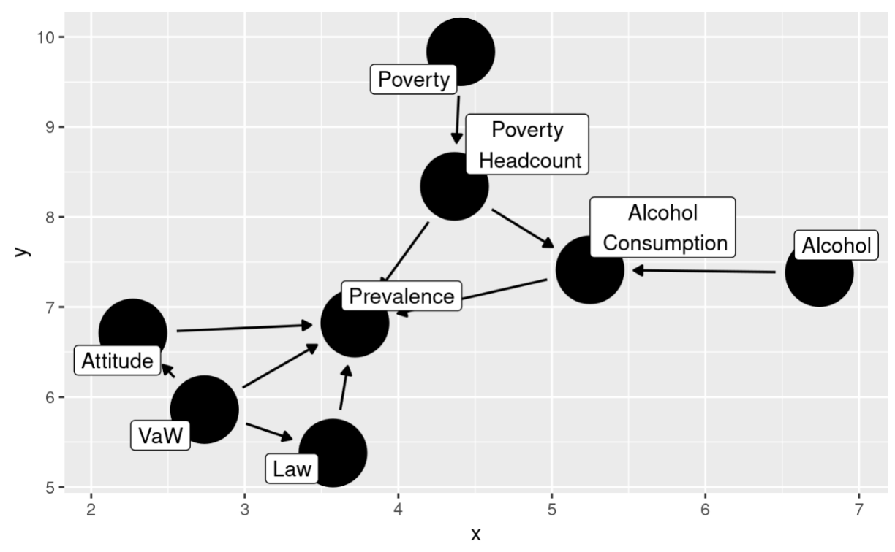

# Violence-Against-Women

CDAD-UH 1043EQ Data and Society | Fall 2021 | Final Project

"The aim of this project is to understand how social/political/economic factors are associated with the OECD’s Violence Against Women data. Our primary data source comes from a 2019 OECD study of violence against women using three indicators (attitudes, laws and experience of violence)."

## Data Source

1. 2019 OECD study of violence against women (attitudes, laws and experience of violence): https://data.oecd.org/inequality/violence-against-women.htm#indicator-chart

2. The World Bank Alcohol Consumption: https://www.google.com/url?q=https://data.worldbank.org/indicator/SH.ALC.PCAP.LI&sa=D&source=editors&ust=1639905871931000&usg=AOvVaw1PMXXRVCEnvh0sHFCmpZsX

3. Country-Continent data: https://wzb-ipi.github.io/corona/df_full.csv

## Report

The report was written using Rmarkdown.

`report.rmd` contains all the codes for the analysis. Please knit the file and check the HTML output. If knitting the Rmarkdown does not work for some reason, please check `report.html`. It was the output I had last time. If this doesn't work either, please check `presentations & report/Report.pdf`.

You will probably get a different output of the causal graph every time you knit the report, so please refer to this one where the lables do not overlap.

